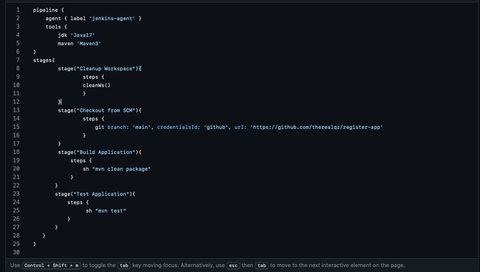
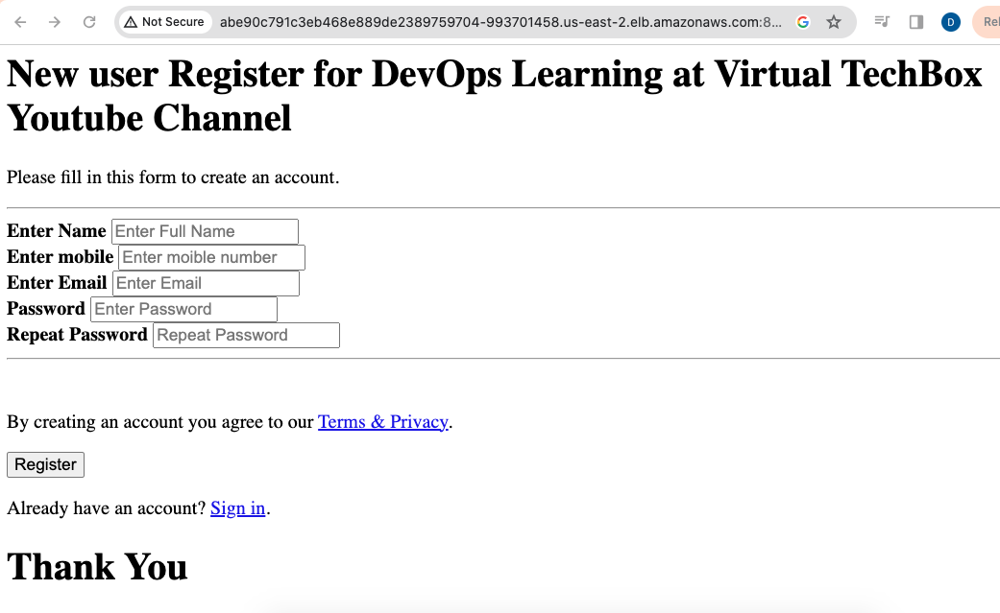

###  CI/CD pipeline to deploy a Java App to EKS Kubernetes #
---

This project uses EKS Cluster using the  Nodegroup Profile. Here are some other tools used :
1. Jenkins - The main CI solution
2. SonarQube - For repo analysis
3. ArgoCD - GitOps for the continous delivery to the K8 cluster
4. AWS EKS - AWS' Elastic Kubernetes Service
5. Maven

2nd Part of the project for GitOps CD =>   https://github.com/therealqz/gitops-register-app

---

##### STEP 1 #

1.  Create Jenkins Master server, Change the hostname to jenkins-master .Allw inbound rule for Port 8080.

-  Install Java `sudo apt install default-jre`   on both master & agent
Install Jenkins using the weekly release from the jenkins site

Create a new Jenkins-agent server Where all the builds will happen

Install Docker  `apt-get install docker.io`

Add current user to the Docker group `usermod -aG docker $USER` . Restart server


On `vi /etc/ssh/sshd_config`  , set PubKeyAuthentication to yes and authorizekeyfile on  both Jenkins Master & Agent servers . 

On Jenkins-Master node, generate ssh keys using `ssh-keygen` and copy it to the Jenkins-agent node using `ssh-copy-id` OR by simply doing a copy-paste the pubkey on master to the authorized_keys file in the jenkins-agent server to allow access from master to agent. 


Jenkins Dashboard => System Config / Manage Jenkins  , Change # of executors on in-built nodes from 2 to 0 and increase the # of executors on the Jenkins-Agent node to 2.

This indicates the  maximum number of concurrent builds that Jenkins may perform on this node

Host key strategy - non verifying.copy jenkins master private key … Save

Create test job and build successfully : NewJob / pipeline /

 The essence is to verify the connectivity between the 2 jenkins nodes
             ---

#### Integrate Maven to Jenkins & Add GitHub Credentials #

Install & Configure these plugins on the jenkins server:

Maven integration   : manage/ tools / add maven/name it “Maven3”  SAVE
Pipeline Maven integration
Eclipse Tumerin installer
      
Configure Jenkins Credentials, /manage/credentials/


Note: configure access token instead of password

---

 ####  
 Create Pipeline Script (Jenkinsfile ) to automate build & test artifacts &  Create CI job on Jenkins 
 #

 On the repo ,Create the first jenkinsfile. I'll update it as we progress : 
 
 Steps … Cleanup workspace  ⇒ 
 
 Checkout SCM ⇒ Build Application ⇒ 
 
 Test Application ==> 

 

 

On Jenkins dashboard, create a PIPELINE Project and keep 2 builds for logRotation.


#### NEXT : Set Up SonarQube  #
System requirement: Minimum 2CPU ,4 gb RAM 

Update apt repo `sudo apt update`

Add the postgreSQL repo => install software packages needed to download and install the config  using a secure SSL connection.

``sudo apt install wget ca-certificates
`

Then, get the certificate, add it to apt-key management utility and create a new configuration file with an official PostgreSQL repository address inside.

```

` wget --quiet -O - https://www.postgresql.org/media/keys/ACCC4CF8.asc | sudo apt-key add -  `

           ` sudo sh -c 'echo "deb http://apt.postgresql.org/pub/repos/apt/ $(lsb_release   -cs)-pgdg main" >> /etc/apt/sources.list.d/pgdg.list `

```

`sudo apt update`

`apt install postgresql postgresql-contrib `


- Create SonarQube Database.

 Refer to the installation-scripts file in the repo for the installation commands.

PostgreSQL creation


 After creating PostgresDB , 

Next Add the Adoptium repository ⇒ 

Follow this guide:  https://adoptium.net/en-GB/installation/linux/

---
#### STEP 7:  Linux Kernel Tuning to increase limits #

nofile value refers to the maximum number of open files for a single process. It refers to the maximum number of files that can be allocated to a single process, usually with a default value of 1024 * 1024 = 1048576 

    `  sudo vim /etc/security/limits.conf `
    //Paste the below values at the bottom of the file
    sonarqube   -   nofile   65536
    sonarqube   -   nproc    4096

# Increase Mapped Memory Regions

  ` sudo vim /etc/sysctl.conf `
    //Paste the below values at the bottom of the file
    vm.max_map_count = 262144


---

 #### Step 8 INSTALL SONARQUBE


```


#### Sonarqube Installation ####
## Download and Extract
    $ sudo wget https://binaries.sonarsource.com/Distribution/sonarqube/sonarqube-9.9.0.65466.zip
    $ sudo apt install unzip
    $ sudo unzip sonarqube-9.9.0.65466.zip -d /opt
    $ sudo mv /opt/sonarqube-9.9.0.65466 /opt/sonarqube
## Create user and set permissions
     $ sudo groupadd sonar
     $ sudo useradd -c "user to run SonarQube" -d /opt/sonarqube -g sonar sonar
     $ sudo chown sonar:sonar /opt/sonarqube -R
## Update Sonarqube properties with DB credentials
     $ sudo vim /opt/sonarqube/conf/sonar.properties
     //Find and replace the below values, you might need to add the sonar.jdbc.url
     sonar.jdbc.username=sonar
     sonar.jdbc.password=sonar
     sonar.jdbc.url=jdbc:postgresql://localhost:5432/sonarqube
## Create service for Sonarqube
$ sudo vim /etc/systemd/system/sonar.service
//Paste the below into the file
     [Unit]
     Description=SonarQube service
     After=syslog.target network.target

     [Service]
     Type=forking

     ExecStart=/opt/sonarqube/bin/linux-x86-64/sonar.sh start
     ExecStop=/opt/sonarqube/bin/linux-x86-64/sonar.sh stop

     User=sonar
     Group=sonar
     Restart=always

     LimitNOFILE=65536
     LimitNPROC=4096

     [Install]
     WantedBy=multi-user.target

## Start Sonarqube and Enable service
     $ sudo systemctl start sonar
     $ sudo systemctl enable sonar
     $ sudo systemctl status sonar

## Watch log files and monitor for startup

     sudo tail -f /opt/sonarqube/logs/sonar.log


```
SonarQube Dashboard


---

####  STEP 9 
  INTEGRATE SONARQUBE WITH JENKINS #

From SonarQube Dashboard, generate a TOKEN to integrate sonarqube with Jenkins . 

Copy and save the token 

From Jenkins Dashboard, add the SonarQube token to Jenkins credentials using the “secrets option” .


From Jenkins Dashboard, install 3 plugins - 

Sonarqube scanner, sonar quality gates & quality gates 

On Jenkins Dashboard CONFIGURE / TOOLS , add sonarqube server & configure sonarqube scanner.

Update the Jenkinsfile to reflect these new SonarQube Analysis stage of the pipeline
         SCREENSHOT
 
      
Build 2 passed sonarqube analysis

  
---
Add a WebHook for SonarQube . use the Jenkins master private ip address   http://10.118.0.2/sonarqube-webhook/

Add SonarQube Quality gate step in the Jenkinsfile

Build To test phase. 

*** 

#### STEP 10: Build & Push Docker image using pipeline #

Install the following 6 plugins for Docker :
 Docker, docker commons, docker pipeline, docker API, docker build step, CloudBees docker push 

On the Jenkins Dashboard ,Configure Docker credentials using Access Token.

Define variables in the Pipeline Script and add the Docker stages to it

``` 
environment {
	    APP_NAME = "register-app-pipeline"
            RELEASE = "1.0.0"
            DOCKER_USER = "therealqz"
            DOCKER_PASS = ‘docker’
            IMAGE_NAME = "${DOCKER_USER}" + "/" + "${APP_NAME}"
            IMAGE_TAG = "${RELEASE}-${BUILD_NUMBER}"
	    JENKINS_API_TOKEN = credentials("JENKINS_API_TOKEN")
    }

```
   

Add “Trivy Scan stage” to Pipeline script to Scan Docker Image
Add another stage in Jenkinsfile to remove artefacts after the scan and clear the image


---


#### STEP 11 : Set up Bootstrap server for eksctl and Setup kubernetes using eksctl #


Spinoff an EC2 instance and name it EKS-Bootstrap-server

Update package repo and upgrade 

`sudo apt update` && `sudo apt upgrade`

Install awscli , eksctl and kubectl 

---


#### STEP 12: Install IAM #


Create role, add selected entity (AWS service )  assign administrator permissions to Ec2 ,name role **eksctl_role** . 


Next ( IMPORTANT ): On EC2 Dashboard / select the instance / Security / Modify IAM Role .  
**_READ UP ON IAM ROLE_**


---

##### STEP 13: Create EKS Cluster #

 Install AWS Cli on the above EC2
             
Refer--https://docs.aws.amazon.com/cli/latest/userguide/getting-started-install.html

```
$ sudo su
$ curl "https://awscli.amazonaws.com/awscli-exe-linux-x86_64.zip" -o "awscliv2.zip"
$ apt install unzip,   $ unzip awscliv2.zip
$ sudo ./aws/install
         OR
$ sudo yum remove -y aws-cli
$ pip3 install --user awscli
$ sudo ln -s $HOME/.local/bin/aws /usr/bin/aws
$ aws --version

```
##### Installing kubectl #
Refer--https://docs.aws.amazon.com/eks/latest/userguide/install-kubectl.html

```
$ sudo su
$ curl -O https://s3.us-west-2.amazonaws.com/amazon-eks/1.27.1/2023-04-19/bin/linux/amd64/kubectl

$ ll , $ chmod +x ./kubectl  //Gave executable permisions

$ mv kubectl /bin   //Because all our executable files are in /bin

$ kubectl version --output=yaml
```
##### Installing  eksctl #

Refer---https://github.com/eksctl-io/eksctl/blob/main/README.md#installation

```
$ curl --silent --location "https://github.com/weaveworks/eksctl/releases/latest/download/eksctl_$(uname -s)_amd64.tar.gz" | tar xz -C /tmp
$ cd /tmp
$ ll
$ sudo mv /tmp/eksctl /bin
$ eksctl version

```

## Setup Kubernetes using eksctl

Refer--https://github.com/aws-samples/eks-workshop/issues/734

`
$ eksctl create cluster --name virtualtechbox-cluster \
--region ap-south-1 \
--node-type t2.small \
--nodes 3 \
`

 `kubectl get nodes`


SCREENSHOT EKSCTL create cluster
SCREENSHOT  Cluyster ready

EKSCTL create cluster


cluster created


  Run `kubectl get nodes`  to see the nodes in the cluster
---

#### STEP 14:  Install ArgoCD to EKS Cluster & Add EKS Cluster to ArgoCD #


1 ) First, create a namespace for ArgoCD
    `kubectl create namespace argocd`

2 ) Next, let's apply the yaml configuration files for ArgoCd

    `kubectl apply -n argocd -f https://raw.githubusercontent.com/argoproj/argo-cd/stable/manifests/install.yaml`

3 ) Now we can view the pods created in the ArgoCD namespace.

    `kubectl get pods -n argocd`

4 ) To interact with the API Server we need to deploy the CLI:
    `curl --silent --location -o /usr/local/bin/argocd https://github.com/argoproj/argo-cd/releases/download/v2.4.7/argocd-linux-amd64`

     `chmod +x /usr/local/bin/argocd`

5 ) Expose argocd-server
    `kubectl patch svc argocd-server -n argocd -p '{"spec": {"type": "LoadBalancer"}}' `

      Access the argocd dashboard with the load balancer IP address

6 ) Wait about 2 minutes for the LoadBalancer creation
    `kubectl get svc -n argocd`
    


7 ) Get password and decode it.. 
    `kubectl get secret argocd-initial-admin-secret -n argocd -o yaml`

    `echo WXVpLUg2LWxoWjRkSHFmSA== | base64 --decode`

      Copy and save the newly decoded password: pxZ0QkFkPWvXobbr  .Then change the password on the ArgoCD dashboard


    SCREENSHOT commands
    

  SCREENSHOT ARGOCD Dashboard
  

         

---

#### Add EKS Cluster to ArgoCD #

9 ) login to ArgoCD from CLI

     `argocd login https://a48758a25b272470b91057bcd58d5dda-1440853681.us-east-2.elb.amazonaws.com --username admin`

10 ) 
  `argocd cluster list`

11 ) Below command will show the EKS cluster
     `kubectl config get-contexts`

12 ) Add above EKS cluster to ArgoCD with below command
      
      `argocd cluster add i-08b9d0ff0409f48e7@virtualtechbox-cluster.ap-south-1.eksctl.io --name register-app-eks-cluster`

13 )  kubectl get svc


---


#### **STEP 15**:  Configure ArgoCD to deploy pods on EKS & Automate ArgoCD deployment job using GitOps with GitHub repo
#

This 2nd repo holds the manifest files for Kubernetes	

https://github.com/therealqz/gitops-register-app.git

Connect your ArgoCD to EKS cluster : ArgoCd Dashboard / Settings / Connect Repo  


ArgoCD-Connected


Connect EKS to ArgoCD

On ArgoCD dashboard , “Create new app” and connect the EKS cluster in default namespace to self heal and select other options.

Note: The name and version of the docker image on the deployment.yaml file should match what we have on dockerhub

SCREENSHOT: eks connected to argo

Copy the LoadBalancer IP and access the app from the browser.

Abe90c791c3eb468e889de2389759704-993701458.us-east-2.elb.amazonaws.com:8080    . 

You’ll see the apachetomcat default page.




The application can be accessed in the /webapp directory
abe90c791c3eb468e889de2389759704-993701458.us-east-2.elb.amazonaws.com:
8080/webapp


STEP 16 : Set-up CD job on jenkin


Back to Jenkins Dashboard, create a new pipeline job to automate the deployment
Create /configure new job named : gitops-register-app-cd

Create it to trigger build remotely 


Step 16:  Verify CI/CD Pipeline by doing test commit on repo.

---


Monitoring:
    How to Monitor Kubernetes API Server
How to Monitor etcd
How to Monitor kube-controller-manager
How to Monitor the Kubelet
How to Monitor CoreDNS

To nuke the Kubernetes cluster and bomb all the pods , services, daemonsets, deployments & all k8 needs to function

`kubectl delete all --all --all-namespaces